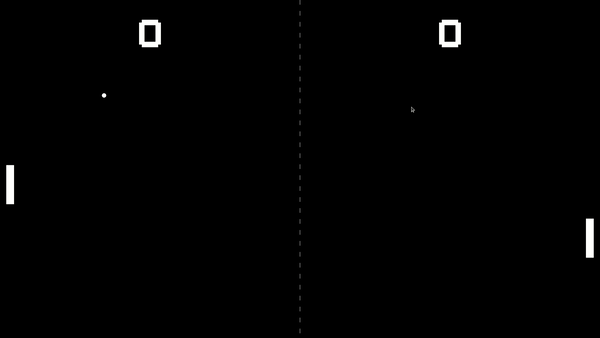

# Learning Canvas
Small projects to practice HTML canvas.

## Pong

Pong is the hello world of graphic libraries. Helpful to understand how to render basic figures such as rectangles and circles, add text on screen, and handle events.

    
</dov>